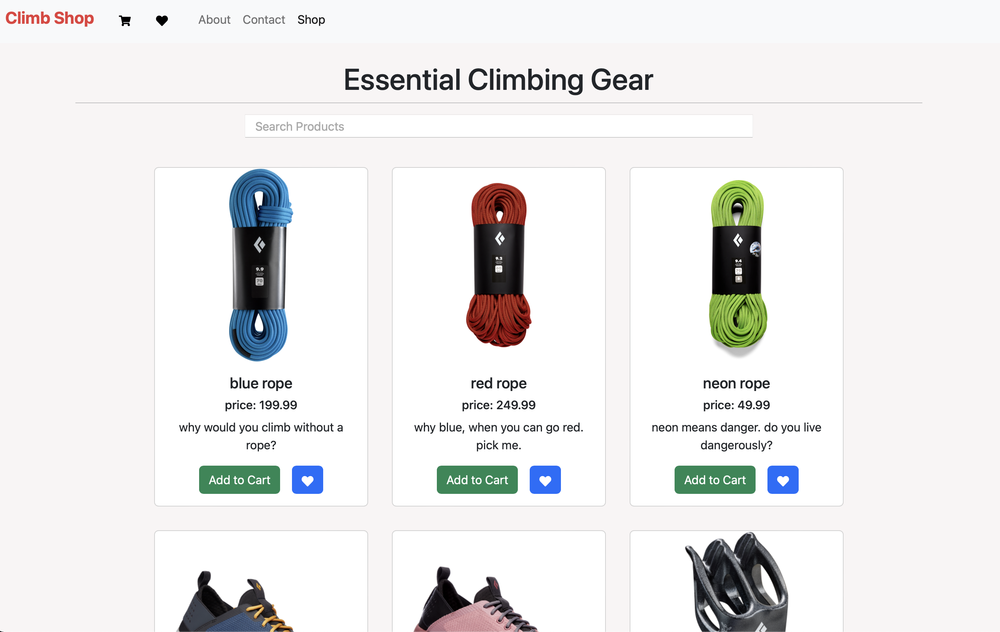
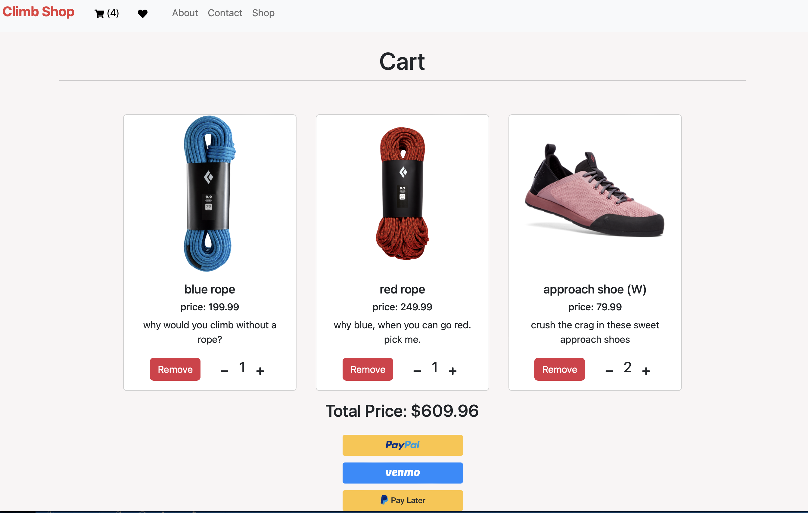

<h1> Climb Shop </h1>

Live website: https://climb-shop.netlify
# Overview
- [About the Project](#about-the-project)
- [Features](#features)
- [Videos & Screenshots](#videos-and-screenshots)
- [Built With](#built-with)
- [Acknowledgments](#acknowledgments)
- [Authors](#authors)
## About The Project

Climb Shop is a rock climbing e-commerce application built with React, Redux, and styled with React Bootstrap. Features Paypal implementation for checkout.
## Features
- HTML request via Axios to retrieve user testimonials 
- Add/Remove items to cart, adjust quantity 
- Add/Remove favorite items
- Filter shop items in search bar
- Paypal, venmo checkout 
- UI/UX styled with Flexbox, React Bootstrap.

## Videos & Screenshots

   

## Built With 
* React
* Redux
* React Router
* Bootstrap 
* Flexbox 

## Acknowledgements
- [Paypal](https://developer.paypal.com)

## Authors
- **Jeff L** - [jlam3950](https://github.com/jlam3950)

